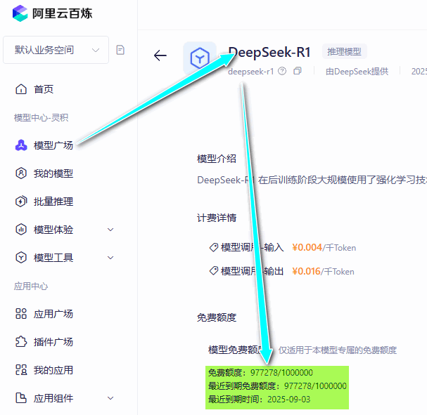

# Use Deep Seek in Unity3d
## Introduction
Want use deepSeek in unity ? 

And use stream to get the rsp data ?

This is for You.

This project is produce at [Unity 接入 DeepSeek 实现 AI 对话功能](https://mp.weixin.qq.com/s/gsKhgVp25f6h4pYcMImexA)

And use stream to request deepseek instead of waiting for long time !

## Features
### Show like markdown
- Title
```markdown 
# Title1 
## Title2
### Title3
#### Title4
##### Title5
###### Title6
```
# Title1 
## Title2
### Title3
#### Title4
##### Title5
###### Title6
- **Bold**
- *Italic*
- ==Highlight==
- ~~Delete~~
- `inline code`
- multi line code
```csharp
  // code 
  int a = 1;
  int b = 2;
  int c = a + b;
```


## Unity 2020.3.9f1c1 

## API Setting
- API Url
- ModelName
- API Key
- ### Aliyun gave all user 1000,000 tokens for free !
    - API Url:`https://dashscope.aliyuncs.com/compatible-mode/v1/chat/completions`
    - Model Name:`deepseek-r1` \
[基于百炼调用 DeepSeek-R1 满血版 API，享100万免费token](https://www.aliyun.com/solution/tech-solution/deepseek-r1-for-platforms)

- ### [siliconflow](https://siliconflow.cn/zh-cn/models) even has free models...
    |Model web page|API Url|modelName|
    |---|---|---|
    |[deepseek-ai/DeepSeek-R1-Distill-Qwen-7B](https://cloud.siliconflow.cn/open/models?target=deepseek-ai/DeepSeek-R1-Distill-Qwen-7B)|`https://api.siliconflow.cn/v1/chat/completions`|`deepseek-ai/DeepSeek-R1-Distill-Qwen-7B`|
    |[deepseek-ai/DeepSeek-R1-Distill-Qwen-1.5B](https://cloud.siliconflow.cn/open/models?target=deepseek-ai/DeepSeek-R1-Distill-Qwen-1.5B)|`https://api.siliconflow.cn/v1/chat/completions`|`deepseek-ai/DeepSeek-R1-Distill-Qwen-1.5B`|

**No matter use aliyun or siliconflow , will parse the rsp data in the same way , and works ok !**


## UseAge 
### 1. Set you API Key in the panel


You can also save / get  it in PlayerPrefs.
On the project run, int the `DeepSeekDialogueManager.Start()` will get it auto.
### 2. Set the apiurl or model name
I used the [aliyun](https://bailian.console.aliyun.com/?spm=a2c4g.11186623.0.0.13c7657bRaapwv#/model-market/detail/deepseek-r1) deepseek api, so the url and model name in the panel is for aliyun.
If you use other api, you can set the apiurl and model name in the panel.

### 3. Set the TMP Font Settings
]]

## Request with stream


## Libs Need 
- LitJson
- DoTween